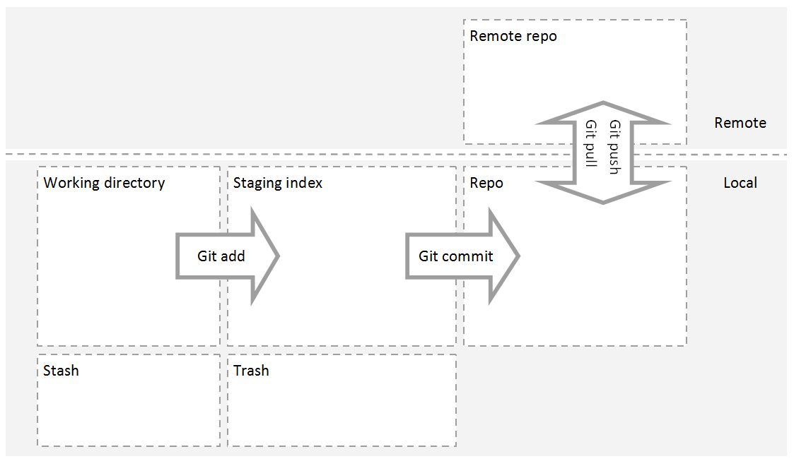

# Using Git as a Pro

## How to use Git, GitLab, Github properly

### Beta Edition, 15.01.2018

> Gene Ting-Chun Kao


## Table of Contents

1. [Git vs GitHub vs GitLab](#1)
2. [Set up your Git](#2)
3. [Basic commands](#3)
4. [Review a repo&#39;s history](#4)
5. [Add commit to a repo](#5)
6. [Tagging, branching, merging](#6)
7. [Experiments using checkout](#7)
8. [Undoing changes](#8)
9. [Collaborating and syncing with GitLab](#9)
10. [Other useful commands](#10)
11. [Development pipeline, branching model and discussion](#11)

Appendix
A. [Git Bash setup](#12)
B. [Cygwin setup](#13)


## 1. Git vs GitHub vs GitLab <a name="1"></a>


Figure 1‑1: Icon of Git, Github and GitLab.


Git is a very powerful tool that every developer should be familiar with.


> By far, the most widely used modern version control system in the world
> today is Git. Git is a mature, actively maintained open source project
> originally developed in 2005 by Linus Torvalds, the famous creator of the Linux
> operating system kernel. A staggering number of software projects rely on Git
> for version control, including commercial projects as well as open source.
[Atlassian.com](https://www.atlassian.com/git/tutorials/what-is-git)


However, many people confuse Git with Github, GitLab, but they are not the same.
[**Git**](https://git-scm.com/) **is a free and open source distributed version
control system, a tool that you can manage your code history. Where**
[**Github**](https://github.com/) **and**
[**GitLab**](https://about.gitlab.com/) **are web-based hosting services for Git
repositories. With Git, you don't even need the internet access, you can
work everything locally and have all version controls.** To connect to GitLab
and working with others, you will need the internet access. The purpose of this
document is to guide readers through all the necessary elements and commands of
using Git, so readers will be able to use Git confidently, and in the proper
way.


More discussion about Git and Github can be found here in the [Stack
Overflow](https://stackoverflow.com/questions/13321556/difference-between-git-and-github).


Here are some nice free tutorials you can find online too:

1. [Official Git documentation](https://git-scm.com/docs/gittutorial).
2. [Learn Git with Bitbucket
   Cloud](https://www.atlassian.com/git/tutorials/learn-git-with-bitbucket-cloud).
3. Udacity: [Version Control with
   Git](https://www.udacity.com/course/version-control-with-git--ud123) and [How
   to Use Git and
   Github](https://www.udacity.com/course/how-to-use-git-and-github--ud775).
4. [Learn Enough Git to Be Dangerous](https://www.learnenough.com/git-tutorial).
5. [Try Git: Git Tutorial](https://try.github.io/levels/1/challenges/1).

## 2. Set up your Git <a name="2"></a>

In this chapter, you are going to set up your Git environment in Windows, Mac or
Linux.  In Linux and Mac, using the default terminal should be just fine. In
windows, you can use [Git Bash](https://git-for-windows.github.io/) or
[Cygwin](https://www.cygwin.com/) (See appendix A and B). After the
installation, run the command which shows in figure 2-1 and sees if you have Git
installed properly.


Figure 2‑1 : To see Git version from the terminal.


Figure 2‑2 Attachment files


Figure 2‑3 git terminal setup

To make your terminal console more git-friendly, you can copy paste the folder
from attachment to your root directory, and copy the content of .bash_profile
to your .bashrc or .bash_profile in the root directory too. (see figure 2-2).
And after copying and pasting those files and file contents, type ```$ source
.bashrc```. Then you should see something like figure 2-3 later when you work
with git.


You should do those configuration commands below before start using git. It is
also important to set up your favorite editor first so you won't get panic
when annoying vi pop out later (I am sorry for vi users lol). For beginners, I
will suggest using nano or other editors with GUI. (Those strings with the brown
color you should replace whatever makes sense to you. Blue are comments,
don't type it in your terminal.)

``` bash
- $ git config --global user.name "Git Rock"
- $ git config --global user.email "git.rock@email.com"
- $ git config --global color.ui auto
- $ git config --global merge.conflictstyle diff3
- $ git config --global core.editor "emacs -nw" # (vi is default setting)
- $ git config --list # (to see your git configurations.)
```

**Before moving on to the next chapter, take a look at all key terms describe**
[**here**](http://video.udacity-data.com.s3.amazonaws.com/topher/2017/March/58d31eb5_ud123-git-keyterms/ud123-git-keyterms.pdf)
**.**


## 3. Basic commands <a name="3"></a>

If you would like to use git as your version control, the first thing you would
have to do is to initialize the git in your project folder with ```git init```
command. After git is initialized, you will see a hidden .git folder in your
directory, see figure 3-1. This is where git store all its information about
your code version. And remember, **do not modify anything in this .git
directory** unless you know what you are doing, they are hidden for good
reasons.


Figure 3‑1: list directory after before and after initialize git.

And one important thing is that **try to use  ```$ git status``` all the time**,
or after each command **.** It always shows you some hints about what you should
do when something goes wrong.**


The following commands are some of the most basic commands that you will use
very often, I will explain other commands later, I just list them here so you
can check the most basic commands after finishing this tutorial.

``` bash
- $ git init
- $ git clone https://github.com/GeneKao/udacity-build-a-portfolio-site.git
- $ git status # (Please use it all the time!)
- $ git log
- $ git add
- $ git commit
- $ git diff
```

## 4. Review a repo&#39;s history <a name="4"></a>

In this chapter, you will learn how to use commands such as ```$ git log``` with
different flags to see all commit history from the repo. (Tips for readers not
familiar with command line. Whenever you are in the
[less](https://en.wikipedia.org/wiki/Less_(Unix)) command environment, which you
will see &quot; **:**&quot; on the bottom-left corner, press **B** and **space**
to go one page up and down. Press **J** and **K** to scroll up and down. **Q**
to quit.)


Let&#39;s clone an existing repo to learn from professional developers. To clone
this [repo](https://github.com/nvie/gitflow) you can type ```$ git clone
https://github.com/nvie/gitflow.git```  to make a copy of existing repo and ```$
cd gitflow``` to move to the directory.


Now you can type one of the most commonly used commands ```$ git log --oneline
--graph --all``` in your terminal, this will list all the commits and branches
like in the figure 4-1.


Figure 4‑1 list all commits and branches using ```git log --oneline --graph --all```

If you want to see more about all commits you can use to ```$ git log --stat```
or ```$ git log --patch``` to show all the details. Or you can use different flags
like ```--after, --author, --grep, -S``` to constrain or to filter the git
information that you want.  Try out all those commands and see what kind of
information you will get:


``` bash
- $ git log --online
- $ git log --stat
- $ git log -p, git log --patch
- $ git log --oneline --decorate --graph --all
- $ git log --after="2017-10-1"
- $ git log --after="yesterday"
- $ git log --after="2017-10-1" --before="2017-10-1"
- $ git log --author="Vincent"
- $ git log --grep="bugs"
- $ git log -- md # (check changes only for README)
- $ git log -S"Hello World" # (any file that string was modified)
- $ git show
``` 

If you would like to see more detail documentation of those optional flags
type```$ git log --help```. 


And don't forget, you can always type your command together with the SHA to
print the specific commit. For example, by typing ```$ git show b72a395```
you will see all detail commit information include the lines have been modified
and line numbers, see figure 4-2.


Figure 4‑2: git show one commit by specifying its SHA.

## 5. Add commit to a repo <a name="5"></a>

Basically, in figure 5-1 you can see a diagram of how Git works. Let's focus on
all local Git functions first. To begin with, three major components of Git are
working directory, staging index and repository. Simply speaking, working
directory is where all your current files are which includes tracked, untracked
and ignored files, staging index is a cache of files that you would like to
commit and the repository is where all Git store all snapshots of your code.




Figure 5‑1: Diagram of Git work directory, staging index and repo

To create a commit to the repo, basically you will need to do it in two steps:

``` bash
1. $ git add md #(or $ git add . to add everything under current directory.)
2. $ git commit -m "add a readme file"
```

What we have done here is add a file that we would like to commit and move it
from working directory to staging index. Assuming we have other files still in
the directory. If we do the commit now, only the change of readme file will be
recorded to the repository.


By the way, it is better not to use the word "**and**" in the one Git commit,
because normally it just makes more sense to separate tasks into two commits.


For more details, I will suggest the reader go through this online course
[Version Control with
Git](https://www.udacity.com/course/version-control-with-git--ud123), this
course explains clearly the concept of the working directory, staging index and
repo. Figure 5-1 shows the summarized diagram, and useful comments are listed
below. (Just ignore the stash command for now or you can try it on your own. I
will explain git stash in the next edition.)

``` bash 
- $ git config -global core.editor emacs # (Configure your favourite editor)
- $ git add # (put them in staging index / stage files)
- $ git commit -m "your comment" # (commit staged files to repo)
- $ git diff
- $ git stash # (make your code WIP and try something else)
- $ git stash pop # (reverse the stash or git stash apply)
- $ git stash list
- $ git stash save "Add style to our site"
- $ git stash show
- $ git log --oneline --graph stash@{1}
- $ git stash branch add-stylesheetstash@{1}
- $ git stash drop stash@{1}
- $ git stash clear
  # (Set up .gitignore file)
```


Figure 5‑2: git stash

## 6. Tagging, branching, merging <a name="6"></a>

When you want to create the separated development, you can create the branch.
You can imagine this as actual tree branches. You store all your different
development in different branches so they are separated with each other. So
let's create a branch called develop by typing ```$ git branch develop```. 
Then if you type ```$ git branch --list -all``` you will see all
branches, and the \* symbol indicates the current development branch you are at,
the default branches is **master**. By switching between different branches you
need to type ```$ git checkout develop```. **One thing amazing is that all
your files switch automatically whenever you switch between branches**. By doing
this, you can experiment different kinds of stuff and don't need to worry
about messing up your correct code or to back up all your previous development
files.


After you modify your separated development, you can use Git merge to merge one
branch with another branch. Normally Git will merge it automatically, unless two
branches have modified the same lines, then you will have to manually fix them.

``` bash
- $ git tag -a v1.0 (create)
- $ git tag -a v1.0 a87984 (create)
- $ git tag -d v1.0 (delete)
- $ git branch (check)
- $ git branch dev_frontend =git checkout -b dev_frontend
- $ git branch -d dev_frontend (delete)
- $ git checkout dev_frontend
- $ git checkout dev_frontend43s20r
- $ git checkout dev_frontendmaster
- $ git merge dev_frontend
```


## 7. Experiments using checkout <a name="7"></a>

You can not only experiment your code using different branches and switch
between them by using git checkout, but also switch to your previous commit or
specific files.

``` bash
- $ git checkout dev\_frontend # (branch)
- $ git checkout 43s20r # (commit)
- $ git checkout 43s20rpy # (file)
- $ git checkout HEADpy # (go back)
```

## 8. Undoing changes <a name="8"></a>

To modify the commit, you can type ```$ git commit --amend``` to modify the last
commit. To delete commits use ```$ git reset``` , and it has three different
flags. Mixed is to move the commit back to the working directory, and this is
the default flag. Soft is to move commit to staging index. Hard is to move
commit to trash directly, so be careful to use it. When you better not use reset
on the public repo, because this will mess up other people's development.
Use git revert instead, this will create a new commit to undo the previous
commit.

``` bash
- $ git commit --amend # (modify the last commit Don&#39;t use it in Public History)
- $ git revert 43s20r # (create a new commit to undo)
- $ git reset HEAD~1 # (Be careful! Don't use it in Public History)
- $ git reset --mixed HEAD~1 # (move to working directory, this is default, add and commit)
- $ git reset --soft HEAD~1 # (move to staging index, commit)
- $ git reset --hard HEAD~1 # (move to trash, deleted)
```

## 9. Collaborating and syncing with GitLab <a name="9"></a>

After having some commits, you might want other people to join your development
or back up the code on GitHub or GitLab. By doing this, you must set up the
connection between your local repo and remote repo. To see the connection you
can type ```$ git remote -v``` and use ```$ git remote add remote
YourRemoteURL``` to set the connections. And ```$ git pull``` to download all
the changes and ```$ git push origin mater``` to upload your repo.


More information to see [GitHub
documentation](https://help.github.com/articles/adding-an-existing-project-to-github-using-the-command-line/#platform-linux)
(GitLab is more or less the same).


``` bash
- $ git remote
- $ git fetch
- $ git pull
- $ git push
```

## 10. Other useful commands <a name="10"></a>

``` bash
- $ git diff-tree --no-commit-id --name-only -r d51488d # (list all files changes in a commit)
- $ git ls-tree --name-only -r d51488d # (list all files in a commit)
```

## 11. Development pipeline, branching model and discussion <a name="11"></a>

I will suggest to use gitflow to managing your version and big software
development. You can also install it on the command line so everything become so
easy.


Check the official repository on GitHub:

[https://github.com/nvie/gitflow](https://github.com/nvie/gitflow)

``` bash
- $ git flow init
- $ git flow feature start feature/dev-gk-responsive
- $ git flow feature finish feature/dev-gk-responsive
- $ git flow feature publish feature/dev-gk-responsive
- $ git flow feature pull remote feature/dev-gk-responsive
```


# Appendix

## A. Git Bash setup <a name="12"></a>

Installation procedure for using git bash as linux VM connector:

[https://git-for-windows.github.io/](https://git-for-windows.github.io/)

Create a .profile in the home directory like:

``` bash
alias q="exit"
alias dir="ls -al"
alias vm="ssh -i ~/.ssh/id_rsa_np new_user@YOUR_IP"

function cd {
    builtin cd "$@" && dir
}

# Interactive operation...
alias rm='rm -i'
alias cp='cp -i'
alias mv='mv -i'

# Default to human readable figures
alias df='df -h'
alias du='du -h'

# Misc :)
alias less='less -r' # raw control characters
alias whence='type -a' # where, of a sort
alias grep='grep --color' # show differences in colour
alias egrep='egrep --color=auto' # show differences in colour
alias fgrep='fgrep --color=auto' # show differences in colour


# Some shortcuts for different directory listings
alias ls='ls -hF --color=tty' # classify files in colour
alias dir='ls --color=auto --format=vertical'
alias vdir='ls --color=auto --format=long'
alias ll='ls -l' # long list
alias la='ls -A' # all but . and ..
alias l='ls -CF' #

# Enable tab completion
source ~/.git-terminal-config/git-completion.bash

# Change command prompt
source ~/.git-terminal-config/git-prompt.sh

# colors!
red="\[\033[38;5;203m\]"
green="\[\033[38;05;38m\]"
blue="\[\033[0;34m\]"
yellow="\[\033[1;33m\]"
gray="\[\033[1;30m\]"
reset="\[\033[0m\]"

export GIT_PS1_SHOWDIRTYSTATE=1

# '\u' adds the name of the current user to the prompt
# '\$(__git_ps1)' adds git-related stuff
# '\W' adds the name of the current directory
export PS1="$red\u$yellow\$(__git_ps1)$green \W
$ $reset"
# Set Git language to English
#alias git='LANG=en_US git'
alias git='LANG=en_GB git'
# Set Git language to English
#alias git='LC_ALL=en_US git'
alias git='LC_ALL=en_GB git'

```


In git bash, run the following commands:

## B. Cygwin setup <a name="13"></a>

This is nothing to do with the Git setup. It is just how we setup the Cygwin,
and with this documented you can save your time googling around.


    1. First install cygwin 32 bit, because some function don't work in 64 bit.
    2. Download the file from "rawgit.com/transcode-open/apt-cyg/master/apt-cyg"
    3. Copy apt-cyg file to /bin in your C:\cygwin\bin
    4. Run &quot;chmod +x /bin/apt-cyg&quot; to make sure that apt-cyg is executable.
    5. $ echo 'export http_proxy=proxy:8080'>>~/.bashrc # to make sure that proxy settings.
    6. $ echo 'export https_proxy=proxy:8080'>>~/.bashrc
    7. Use the original package manager to install wget first.
    8. Everything should be fine at this moment, try "apt-cyg install nano"
    9. You can also use apt-cyg searchall to search packages.


Dependency for x please see https://x.cygwin.com/docs/ug/setup.html

To install python inside cygwin see https://github.com/h2oai/h2o-2/wiki/Installing-Python-inside-Cygwin
